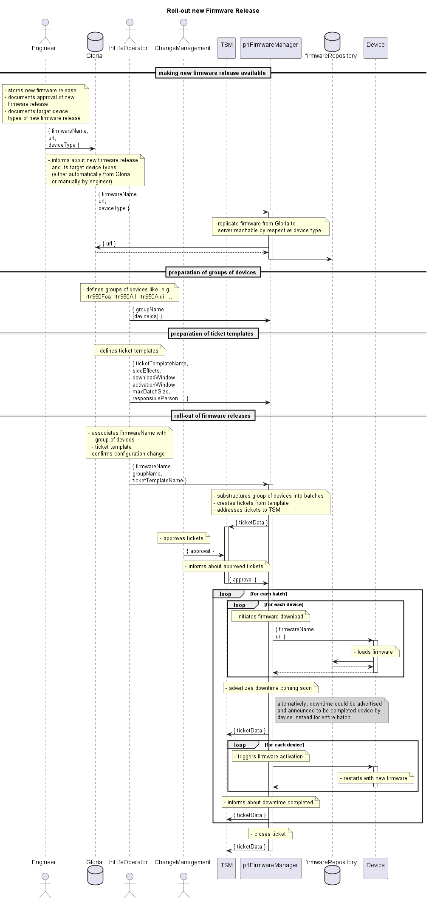

# Gloria based Approach

The follow process has been elaborated together with Inlife Operation.  

Er basiert bereits auf der Idee, dass einmalig eine Zuordnung zwischen einer Firmware und einer Gruppe von Geräten (z.B. alle Geräte eines bestimmten Hardwaretyps) erstellt wird und der Roll-out auf den Geräten in der Gruppe automatisiert ausgeführt wird.  

Es stellte sich im weiteren allerdings heraus, dass diese Zuordnung nicht in Gloria erfolgen kann.

  

